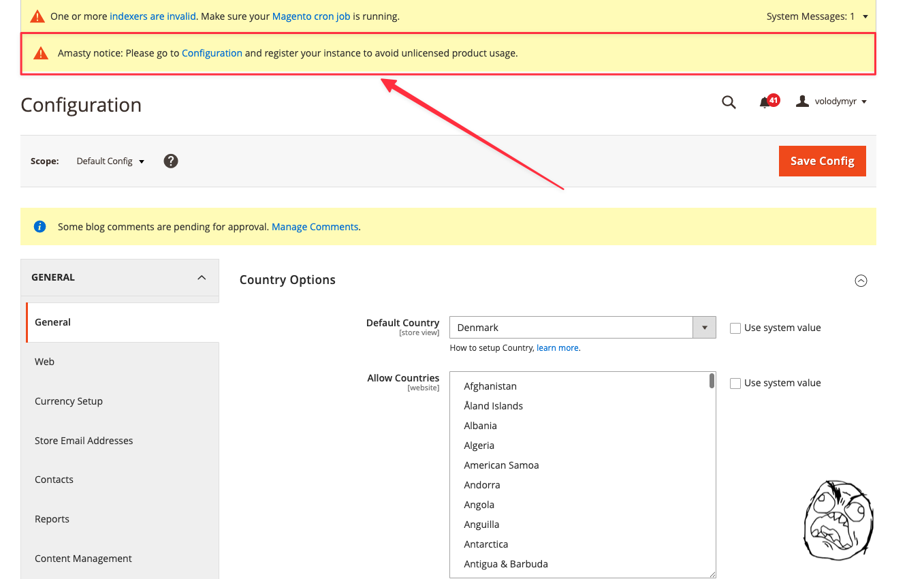

# Magento 2 Remove Amasty Registration Notice

This module removes the Amasty extension registration notices that appear in the Magento admin panel. It provides a cleaner admin experience by eliminating these repetitive notifications.

## Features

- Removes Amasty registration notices from the admin panel
- No configuration required - works automatically after installation
- Lightweight solution with no impact on performance



## Requirements

- Magento 2.4.4 or higher
- PHP 8.1 or higher
- Amasty Base module

## Installation

### Composer (recommended)

```bash
composer require hryvinskyi/magento2-remove-amasty-registration-notice
bin/magento module:enable Hryvinskyi_RemoveAmastyRegistrationNotice
bin/magento setup:upgrade
bin/magento setup:di:compile
bin/magento setup:static-content:deploy
```

### Manual Installation

1. Download the module and upload it to `app/code/Hryvinskyi/RemoveAmastyRegistrationNotice`
2. Enable the module and update the database:

```bash
bin/magento module:enable Hryvinskyi_RemoveAmastyRegistrationNotice
bin/magento setup:upgrade
bin/magento setup:di:compile
bin/magento setup:static-content:deploy
```

## How It Works

This module overrides the `getMessage()` method in Amasty's license registration view model to return `null` instead of registration messages, effectively removing the notice from admin panels.

## License

MIT

## Author

Volodymyr Hryvinskyi  
Email: volodymyr@hryvinskyi.com  
GitHub: https://github.com/hryvinskyi